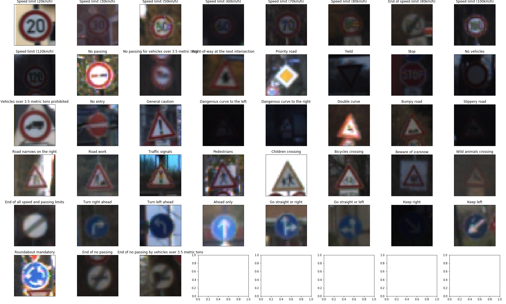
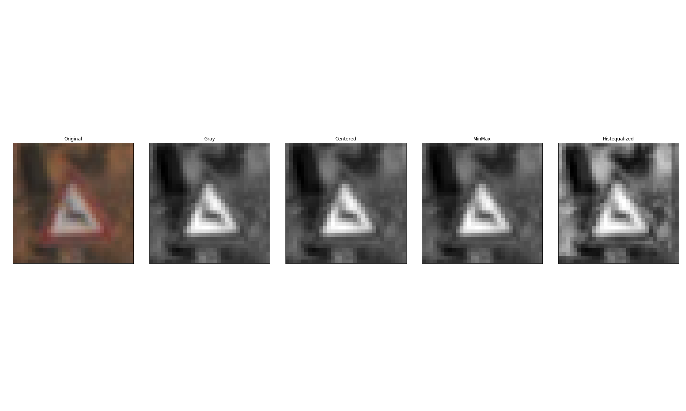
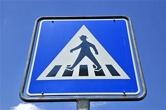
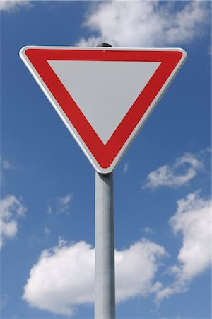

# **Traffic Sign Recognition** 
## Zoltán Puha - Udacity

---

**Build a Traffic Sign Recognition Project**

## Rubric Points
### Here I will consider the [rubric points](https://review.udacity.com/#!/rubrics/481/view) individually and describe how I addressed each point in my implementation.  

---

### Data Set Summary & Exploration

#### 1. Provide a basic summary of the data set. In the code, the analysis should be done using python, numpy and/or pandas methods rather than hardcoding results manually.

I used the pandas library to calculate summary statistics of the traffic
signs data set:

* The size of training set is 34799
* The size of the validation set is 4410
* The size of test set is 12630
* The shape of a traffic sign image is 32*32*3
* The number of unique classes/labels in the data set is 43

#### 2. Include an exploratory visualization of the dataset.

Here is an exploratory visualization of the data set. It is a bar chart showing how the data ...

It can be seen that there are some signs that cann't be seen clearly.

### Design and Test a Model Architecture

#### 1. Describe how you preprocessed the image data. What techniques were chosen and why did you choose these techniques? Consider including images showing the output of each preprocessing technique. Pre-processing refers to techniques such as converting to grayscale, normalization, etc. 

At first, I converted the images to grayscale, to only have to deal with 1 channel. Also, in this problem, the color of the picture doesn't play a big role, as there are no signs that only differ in color.
I tried out different techniques: normalization, minmax scaling and histogram equalization.
In  the end I used the CLAHE (histogram) technique, as it yielded the best restults.
Here is an image of the differetn techniques.

In the end, after the preprocessing step I ended up with  images of size 32x32x1

#### 2. Describe what your final model architecture looks like including model type, layers, layer sizes, connectivity, etc.) Consider including a diagram and/or table describing the final model.

My final model consisted of the following layers (every convolutional is followed by a relu:

| Layer         		|     Description	        					| 
|:---------------------:|:---------------------------------------------:| 
| Input         		| 32x32x1 gray image   							| 
| Convolution 5x5     	| 1x1 stride, valid padding, outputs 28x28x6 	|
| Convolution 5x5	      	| 1x1 stride, valid padding, outputs 24x24x16 				|
| MaxPooling		| 2x2, stride is 2x2, outputs 12x12x16        									|
| Convolution 3x3				| 1x1 stride, valid, outputs 10x10x16         									|
|	Convolution 1x1					|		1x1 stride, valid, outputs 10x10x16										|
| MaxPooling		| 2x2, stride is 2x2, outputs 5x5x16        									|
|	Dense		400			|		outputs 256										|
|	Dropout			|												|
|	Dense		256			|		outputs 128										|
|	Dropout			|												|
|	Dense		128			|		outputs 43										|

#### 3. Describe how you trained your model.

To train the model I used batch size of 256, epochs 150 (could have used less, as it reached 0.93+ val accuracy after epoch 60) and learning rate of 0.0007. I used AdamOptimizer.

#### 4. Aprroach

I experimented with Batch Normalization and dropout on the dense layers. A dropout of 0.2 for the first and second dense layer helped the model a lot, as it could generalize a lot better as opposite to the overfitting I saw previously. I didnt use BN in the final model.

My final model results were:
* training set accuracy of 0.992
* validation set accuracy of 0.955
* test set accuracy of 0.934

There is still overfitting, as the accuracy on the training set is higher, but I was able to decrease this gap.

### Test a Model on New Images

#### 1. Choose five German traffic signs found on the web and provide them in the report.

Here are five German traffic signs that I found on the web:

  
 

The images have different angles, so that can make the prediction harder. Especially the first and the second one. On the second there are also clouds, that could confuse the model. I expected the model to predict at least 3 or 4 well, however I found that only one was predicted good. 

#### 2. Discuss the model's predictions on these new traffic signs and compare the results to predicting on the test set. At a minimum, discuss what the predictions were, the accuracy on these new predictions, and compare the accuracy to the accuracy on the test set 

Here are the results of the prediction:

| Image			        |     Prediction	        					| 
|:---------------------:|:---------------------------------------------:| 
| Pedestrians      		| General caution   									| 
| Yield     			| General caution 										|
| No entry					| No entry											|
| Right	      		| Ahead only					 				|
| 30km/h		| 80km/h      							|

The model was able to correctly guess 1 of the 5 traffic signs, which gives an accuracy of 20%. This means bad generalization to the images found on  the internet. Maybe it is due to the different angles from where the pictures where made.

#### 3. Describe how certain the model is when predicting on each of the five new images by looking at the softmax probabilities for each prediction. Provide the top 5 softmax probabilities for each image along with the sign type of each probability. 

The code for making predictions on my final model is located in the last cell of my Ipython notebook. All the predicted probabilities are really close to 1 (which means the model is quite sure it is predicting the good thing), only at the last one (30 km/h) the model is unsure. It can be seen easily why, as the km/h signs look nearly the same, moreover the 8 and 3 can be also mistaken quite easily.

